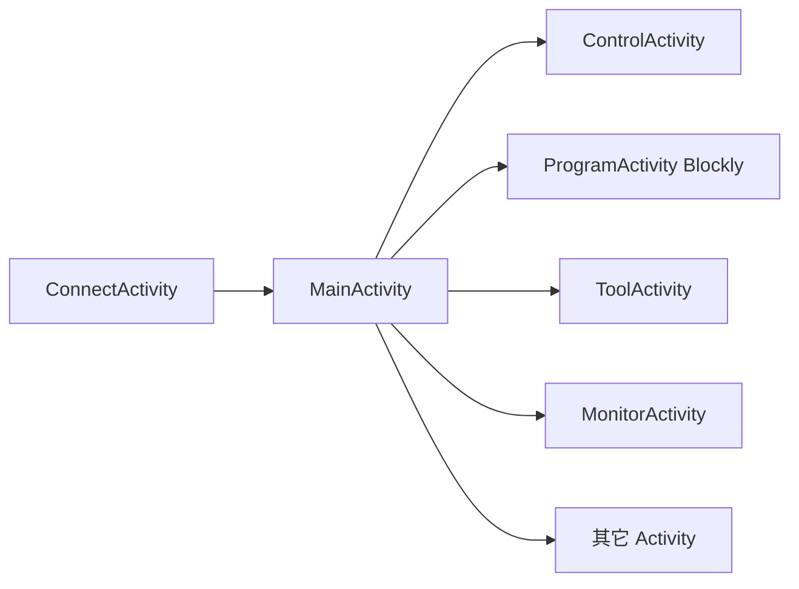

# LPRobot Flutter 移植路线说明

> **用途**：记录已选定的迁移策略、阶段划分、Android 对照与**当前进度**。  
> 约定类规则见 [`../../LPROBOT_DEV_RULES.md`](../../LPROBOT_DEV_RULES.md)。  
> 每次阶段推进或范围变更后：更新本文「进度总览」+ 在 [`changelog/`](./changelog/) 追加更新日志。

**文档版本**：`1.4.8`  
**最后更新**：2026-06-04  
**目标版本**：对齐 Android `1.4.7`

---

## 1. 已选移植路线（决策摘要）

| 决策项 | 选择 | 说明 |
|--------|------|------|
| 参考工程 | `LPRobot-qrcode_http_1.4.7` | 同级目录，包名 `com.lstech.lprobot` |
| 首要平台 | **Windows 桌面** | 先打通现场 PC / 工控平板 |
| Android | 路径 + APK 冒烟 | `RobotPathsAndroid` 实装；`flutter build apk` ✅ |
| 工程文件布局 | `config/` + `files/` | 配置与保存分离，见开发规则 §3 |
| 控制器程序 | `config/server/` | `main.xml`、`main.rp4` |
| 用户工程 / XML 库 | `files/xml`、`files/projects` | 自旧 `config/xml` 迁移 |
| UI 风格 | 领鹏橙 `#FF7E1A` | 布局保持简洁居中，不用大块顶栏卡片 |
| 品牌资源 | `config/imgs/` | `logo_color.png`、`home_top_logo.png` |
| HTTP 实现 | `dart:io` | 避免强依赖 pub.dev `http` 包 |
| 本地设置 | `config/app_settings.json` | 不用 `shared_preferences`（除非后续明确要求） |
| Blockly | 保留 `dll/visualprogram` + 本地 HTTP | `flutter_bound.js` 桥接 |

---

## 2. 总体流程（应用层）

**Flutter 当前入口**：`ConnectPage` → `MainHomePage`（位姿/IO/运行控制）→ Blockly / 控制 / 监控等。

---

## 3. 分阶段移植计划

### 阶段 0：基础架构（Windows）

| 编号 | 任务 | Android 参考 | 状态 |
|------|------|--------------|------|
| 0.1 | `RobotPaths` / `config`+`files` | `RobotCommand` 路径 | ✅ 完成 |
| 0.2 | `HttpManager` 连接骨架 | `connectRobot` | ✅ 完成 |
| 0.3 | `RobotState` 单例 | `RobotCommand` 字段子集 | ✅ 骨架 |
| 0.4 | 全局主题 + Logo | `colors.xml`、`logo_*` | ✅ 完成 |
| 0.5 | `LPROBOT_DEV_RULES.md` | — | ✅ 完成 |
| 0.6 | Windows Release + MSI 打包 | `scripts/package/`、WiX | ✅ 完成 |

### 阶段 1：MVP 可演示（Windows）

| 编号 | 任务 | Android 参考 | 状态 |
|------|------|--------------|------|
| 1.1 | 连接页 | `ConnectActivity` | ✅ 完成 |
| 1.2 | 主页入口 | `MainActivity` | 🟡 **主界面 UI 已对齐**（导航/视口/运行/IO/状态）；维护仍占位 |
| 1.3 | Blockly 本地加载 | `ProgramActivity` | ✅ 已与 Android 1.4.7 对齐（现场验证） |
| 1.4 | Blockly 保存 server/projects/funlib | `BoundObject` | ✅ 已与 Android 1.4.7 对齐（现场验证） |
| 1.5 | 退出编程上传 | `uploadProgramFile` | ✅ 已与 Android 1.4.7 对齐（编辑/保存/退出流程；在线上传 API 已实现） |
| 1.6 | 连接后拉取/同步 `main.xml` | Connect 下载逻辑 | ✅ `connectSyncAndApply` + `config/server/main.*` |

**MVP 定义**：能连机器人 → 进主页 → 打开 Blockly → 保存到 `config/server`；上传与轮询可后置。

### 阶段 2：主界面实时能力

| 编号 | 任务 | Android 参考 | 状态 |
|------|------|--------------|------|
| 2.1 | 后台轮询位姿/IO/报警 | `BackgroundService` | ✅ `RobotStatePoller` + `robotGetCurState`（200ms，`pos`/IO/报警） |
| 2.2 | 主页状态刷新 | `MainActivity` Timer | ✅ `RobotTelemetry` + 顶栏/底栏联动 |
| 2.3 | 速度调节对话框 | `SpeedAdjustDialog` | ✅ 主页右栏速度环 + 对话框 + `setSpeedPercent` |
| 2.4 | IO 指示 | `IOViews` | ✅ `LpRobotIoPanel`（16 路 IN/OUT，宽高自适应） |

### 阶段 3：控制与监控

| 编号 | 任务 | Android 参考 | 状态 |
|------|------|--------------|------|
| 3.1 | 控制页 | `ControlActivity` | 🟡 点动/门型/直线/IO/点库已实现；界面清零 ✅ |
| 3.2 | 监控页 | `MonitorActivity` | 🟡 MVP（RP4 主程序 + 运行行高亮 + 启停） |

### 阶段 4：工具 / 文件 / 参数

| 编号 | 任务 | Android 参考 | 状态 |
|------|------|--------------|------|
| 4.1 | 工具页 | `ToolActivity` | ⏳ 未做 |
| 4.2 | 文件管理 | `FilesActivity` 等 | ⏳ 未做 |
| 4.3 | 参数 / 配置 | `ParamsActivity`、`ConfigFileActivity` | ⏳ 未做 |
| 4.4 | 点库 | `PointLibraryActivity` | 🟡 `PointLibraryPage` 已接入操控页 |

### 阶段 5：扩展功能

| 编号 | 任务 | Android 参考 | 状态 |
|------|------|--------------|------|
| 5.1 | 二维码 | `QRCodeActivity` | ⏳ 未做 |
| 5.2 | 驱动器 / 调试 | `DriverActivity` | ⏳ 未做 |
| 5.3 | 界面清零 | `ClrZeroActivity` | ✅ `ClrZeroPage` + `clrZero` |

### 阶段 6：Android 平台实装

| 编号 | 任务 | 说明 | 状态 |
|------|------|------|------|
| 6.1 | `RobotPathsAndroid` 实路径 | 外置 `LPRobot/` 或应用目录回退 | ✅ |
| 6.2 | 权限 + 横屏 Manifest | 网络/存储/常亮；`sensorLandscape`；测试包名 `com.example.flutter_application_1` | ✅ |
| 6.3 | Blockly assets 策略 | APK 内嵌 `.lpk` → 解压到 `installRoot/dll/visualprogram/` | ✅ |
| 6.4 | `flutter build apk` 冒烟 | — | ✅ 本地构建通过；真机联调待做 |

---

## 4. HttpManager 拆分迁移顺序（阶段 1～4 穿插）

> Android `HttpManager.java` 约 2200 行，按**调用页面**逆向提取，勿整文件翻译。

| 顺序 | 领域 | 典型 command | 服务页面 |
|------|------|--------------|----------|
| 1 | 连接/鉴权 | `connect` | Connect ✅ |
| 2 | 文件上传下载 | `postProgramFile`、`robotGetXmlFile`、`getFile` | Program ✅、Connect 🟡 |
| 3 | 自动运行/状态 | `autorun`、位置 JSON | Main 🟡 |
| 4 | 点动/运动 | `robot_move_*` | Control 🟡（点动/门型/直线/IO/清零 UI 已有） |
| 5 | PLC/寄存器 | `get_reg_D`、`get_coil_M` | Control、Monitor |
| 6 | 点库 | pointlibrary | PointLibrary、Blockly |
| 7 | 参数/驱动 | `uploadRobotParams` 等 | Params、Driver |

---

## 5. Activity → Flutter 页面对照表

| Android Activity | Flutter 规划路径 | 状态 |
|------------------|------------------|------|
| `ConnectActivity` | `features/connect/connect_page.dart` | ✅ |
| `MainActivity` | `features/home/main_home_page.dart` | 🟡 **布局对齐**（6:51:6 + 底栏 IO/状态；缺 3D 视口） |
| `ProgramActivity` | `blockly/blockly_demo_page.dart` | ✅ **已与 Android 1.4.7 对齐**（加载、编辑、保存、退出、进度 UI） |
| `ControlActivity` | `features/control/control_page.dart` | 🟡 点动/门型/直线/IO/点库/界面清零 |
| `MonitorActivity` | `features/monitor/monitor_page.dart` | 🟡 MVP |
| `ToolActivity` | `features/tool/` | ⏳ |
| `FilesActivity` / `ManageFileActivity` / `SDManagerActivity` | `features/files/` | ⏳ |
| `ParamsActivity` / `ConfigFileActivity` | `features/params/` | ⏳ |
| `PointLibraryActivity` | `features/point_library/` | 🟡 |
| `DriverActivity` / `DriverDebugActivity` | `features/driver/` | ⏳ |
| `QRCodeActivity` / `GenQRCodeActivity` | `features/qrcode/` | ⏳ |
| 其它 | 按需追加 | ⏳ |

图例：✅ 可用　🟡 部分　⏳ 未开始

---

## 6. 进度总览

| 阶段 | 名称 | 完成度（估算） | 阻塞下一项 |
|------|------|----------------|------------|
| 0 | 基础架构（含 Release/MSI） | **100%** | — |
| 1 | MVP 可演示 | **~95%** | 控制器 HTTP 全链路真机复核 |
| 2 | 主界面实时 | **~85%** | 顶栏 Logo/Wi‑Fi、IO 组切换等待原功能 |
| 3 | 控制与监控 | **~55%** | Monitor 打印窗等 |
| 4 | 工具/文件/参数 | **~5%** | 点库 MVP |
| 5 | 扩展功能 | **~15%** | 5.3 界面清零 ✅ |
| 6 | Android 实装 | **~60%** | 真机联调（连接→主页→Blockly→操控） |

**整体**：约 **52%**（以 Android 1.4.7 全功能为 100% 估算）。

### 6.0 Windows 优先平台（子进度）

| 子项 | 完成度 | 说明 |
|------|--------|------|
| 路径 / 主题 / Http 骨架 | **100%** | 阶段 0 |
| **Blockly / ProgramActivity** | **100%** | **已与 Android 1.4.7 对齐**（加载、选 XML、保存 server/projects/funlib、编译、退出、进度 UI） |
| **Release + MSI 现场分发** | **~95%** | 双击 bat → `dist/*.msi`；`领鹏智能.exe`；只读安装目录回退（待现场安装冒烟） |
| 连接后 sync `main.*` | **100%** | 连接页 + 断线重连后刷新 |
| 主界面（MainActivity UI） | **~75%** | 布局/轮询/IO/运行控制；缺 3D 机型图 |
| 控制 / 监控 | **~55%** | 点动/IO/清零/点库；Monitor MVP |
| 工具 | **0%** | 阶段 4 |
| **Android APK** | **~60%** | Manifest/横屏/LPK 已完善；真机联调待验 |

**Windows 现场可交付（估算）**：约 **80%**（能连控制器 → 主页看位姿/IO/报警 → 启停程序 → Blockly/监控/操控页完整入口）。

### 6.1 当前可验证能力（Windows）

- [x] 启动创建 `config/`、`files/` 目录结构  
- [x] 连接页：IP 校验、HTTP 连接、记住 IP  
- [x] 跳过连接进入主页  
- [x] 主页进入 Blockly  
- [x] Blockly 读写 `config/server`、`files/xml`、`files/projects`、`files/funlib`  
- [x] **Blockly 操作与 Android `ProgramActivity` 对齐**（加载、编辑、保存、退出、编译与进度 UI）  
- [x] Blockly 退出：离线保存 / 在线上传（含失败重传对话框）  
- [x] Blockly / 保存进度百分比动画（Windows WebView 隐藏原生层）  
- [x] `HttpManager` 全协议骨架（connect / 文件 / 运动 / 状态 / PLC / 点库 / 驱动）  
- [x] Windows MSI 一键打包（`打包Windows安装包.bat` → `dist/*.msi`；发布 exe `领鹏智能.exe`）  
- [x] 连接后 `RobotStatePoller` 轮询位姿/IO/报警（`robotGetCurState`）  
- [x] 主页：顶栏 XYZWABC + J1–J8、左导航、右运行控制、底栏 IO + 启动状态/电机报警  
- [x] 监控页 MVP、控制页（点动/门型/直线/IO/点库/界面清零）
- [x] 连接成功后自动同步 `config/server/main.*`（`connectSyncAndApply`；失败仅告警不阻断）
- [x] Android APK 本地构建（`打包Android安装包.bat` → `dist/*.apk`）
- [x] Android 启动路径回退（`RobotPathsAndroid` + `path_provider`）
- [ ] 与真实控制器联调 HTTP 协议（全链路复核）
- [ ] 操控 IO 写 OUT、界面清零 `clrZero` 真机验证
- [ ] 工具页、3D 机型视口、顶栏 Logo/Wi‑Fi
- [ ] MSI / APK 现场冒烟

### 6.2 下一迭代建议

1. **控制器 HTTP 真机复核**：轮询位姿/IO、自动运行启停、操控 IO 写 OUT、界面清零  
2. **Android 真机**：连接 → 主页 → 操控 → Blockly 冒烟  
3. **MSI 现场验证**：安装 + 主页布局在不同分辨率下无溢出  

---

## 7. 风险与依赖

| 风险 | 缓解 |
|------|------|
| pub.dev 不可达 | 少用可选包；镜像环境变量 |
| Blockly 体积极大 | 发布包独立携带 `dll/` |
| `HttpManager` 体积 | 分模块 + 按页迁移 |
| 白字 Logo 在灰底不可见 | 连接页优先 `logo_color.png` |

---

## 8. 文档维护说明

1. 完成某 **§3 表格** 中的任务 → 改状态列 → 更新 **§6 进度总览**。  
2. 在 [`changelog/CHANGELOG.md`](./changelog/CHANGELOG.md) 顶部追加条目。  
3. 单日变更多时可另建 `changelog/YYYY-MM-DD.md` 写详情。  
4. 更新本文 **文档版本** 与 **最后更新**。

---

## 9. 修订记录

| 版本 | 日期 | 摘要 |
|------|------|------|
| 1.4.8 | 2026-06-04 | Android APK 打包；RobotPathsAndroid；操控 IO/界面清零；整体 ~52% |
| 1.3.0 | 2026-06-03 | 主页 MainActivity UI：位姿栏、轮询、IO、运行控制、布局对齐 Android；阶段 2 ~85%；整体 ~48% |
| 1.2.1 | 2026-06-03 | Blockly 操作已与 Android 1.4.7 对齐（现场验证）；阶段 1 → ~90%；Windows 可交付 ~65% |
| 1.2.0 | 2026-06-03 | Windows MSI 打包链路；发布 exe `领鹏智能.exe`；只读安装目录数据回退；README 打包文档 |
| 1.1.0 | 2026-06-02 | 网络协议全量移植；Blockly 退出上传；加载/保存进度 UI；阶段 1 约 85% |
| 1.0.0 | 2026-06-02 | 初版：选定路线、六阶段计划、Activity 对照、进度约 25% |
